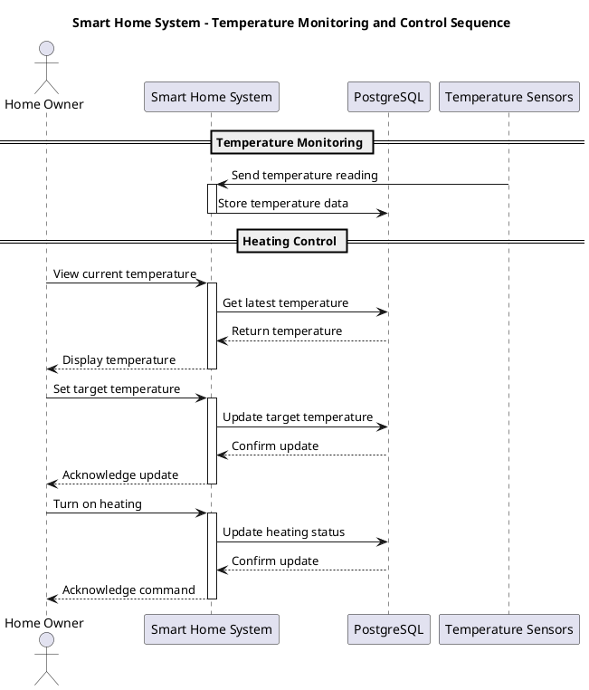
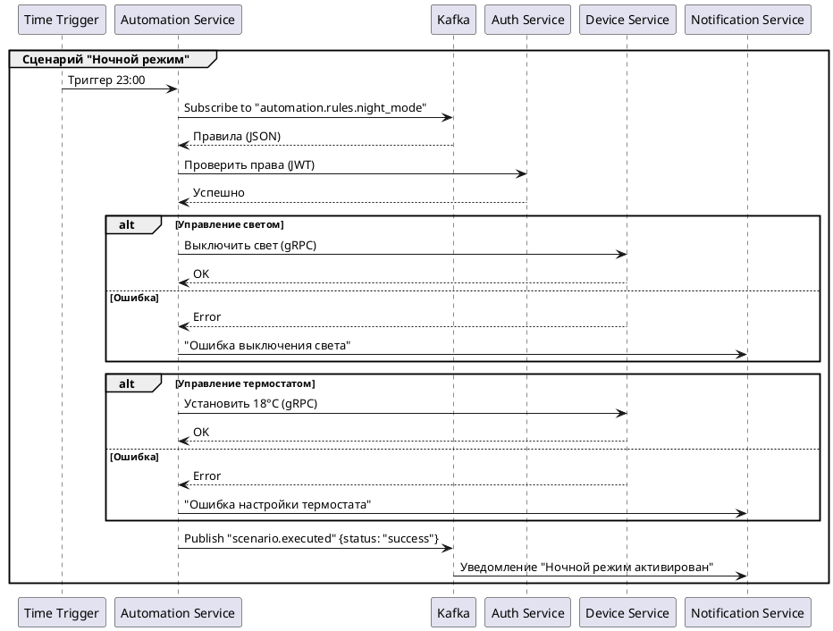
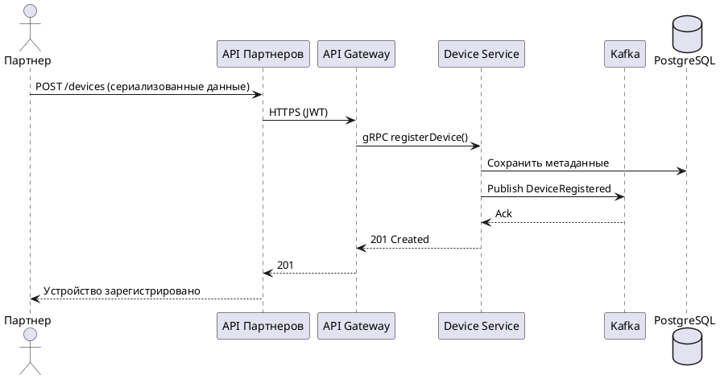
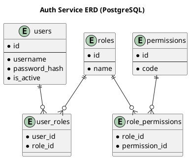
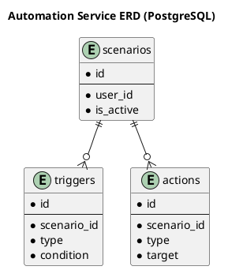
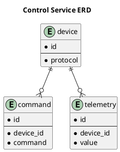
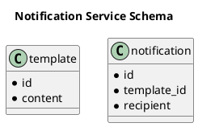
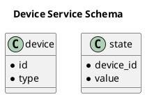

# Project_template

Это шаблон для решения проектной работы. Структура этого файла повторяет структуру заданий. Заполняйте его по мере работы над решением.

# Задание 1. Анализ и планирование

<aside>
💡
- Нынешнее приложение компании позволяет только управлять отоплением в доме и проверять температуру.
- Каждая установка сопровождается выездом специалиста по подключению системы отопления в доме к текущей версии системы.
- Архитектура приложения представляет из себя монолит на Java с СУБД Postgres. Всё синхронно. Никаких асинхронных вызовов, микросервисов и реактивного взаимодействия в системе нет. Всё управление идёт от сервера к датчику. 
- Данные о температуре также получаются через запрос от сервера к датчику.
- Самостоятельно подключить свой датчик к системе пользователь не может.

</aside>

### 1. Описание функциональности монолитного приложения
Функциональность системы можно посмотреть в моках Тестов, в данном случае, она совпадает с функциональностью системы, описанной в коде.

Описание тестов:
===
1. testGetHeatingSystem:
Проверяет корректность получения информации о системе отопления по её ID через GET-запрос.
- Проверяет получение информации о системе отопления по ID.
- Создаёт объект, сохраняет его и проверяет ответ API.

2. testUpdateHeatingSystem:
Проверяет обновление параметров системы отопления через PUT-запрос.
- Тестирует обновление системы отопления.
- Отправляет DTO с новыми значениями и проверяет обновлённые данные.

3. testTurnOn:
Проверяет включение системы отопления через POST-запрос.
- Проверяет включение системы отопления.
- Убеждается, что после запроса система действительно включена.

4. testTurnOff:
Проверяет выключение системы отопления через POST-запрос.
- Проверяет выключение системы отопления.
- Аналогично, но проверяет состояние "выключено".

5. testSetTargetTemperature:
Проверяет установку новой целевой температуры через POST-запрос.
- Тестирует установку целевой температуры.
- Проверяет, что температура действительно изменилась.

6. testGetCurrentTemperature:
Проверяет получение текущей температуры системы через GET-запрос.
- Проверяет получение текущей температуры системы.
- Убеждается, что возвращается правильное значение.


### 2. Анализ архитектуры монолитного приложения


Текущее монолитное решение, монолит <br/>
C4 Context:
===

```markdown
[C4 Context](www.plantuml.com/plantuml/png/RP7FRvjE4CNl_1NpzOb8NvjBJpqbDLRJocve8AfwGckOmahx0-qC9VdlEmkkHHMVl1xcVTxRj_V4Al1eJVAVTeqPMuIUUQ2FMHRKjEiqz-Dv90oDTuoETustsM2KYvejSMlqETj_s1Pnz78wPbOHOv1HlO-ALzuDaPuS7tu-lLJrZo_LOtqyV3vyozEx967D1g6qaW4UlPNZcyWjRE6YXbohBYYR90K6yYwDMVw7pRpyD3aC6_dt0CFy5QRUWvySWN8jMELKXmJSemv0iqalkirTijYaywoEivhcYR3UXOa69--yaIvq0seOZ6uKQx7xvGFqA6VNGImeU3CxYqe2AHu3WlLEim-oSlNDp-dWYRk09EnYEPRVZv0hLcT562rB4I5TyKk-TtH2HnAY5U4LNnzUELqjrSjIzAfMqdAPHg-YVoEvaxdW2BGZLiPWAwUvCn9wyepcql-juawnxdLYvFYxlCLlZHEjao-HuqjMLL4AFS9lO5T5FQDg5zeKD2DT4L_pJ_k5SFlQDvyPNVjle23ucFTlA27Uoz9epHy0)
```

```plantuml
@startuml
!include https://raw.githubusercontent.com/plantuml-stdlib/C4-PlantUML/master/C4_Context.puml

LAYOUT_WITH_LEGEND()

title Smart Home System - Context Diagram

Person(user, "Home Owner", "A person who owns and manages their smart home")
System(smart_home_system, "Smart Home System", "Monolithic application for heating control and temperature monitoring")
SystemDb(postgres, "PostgreSQL Database", "Stores heating system and temperature sensor data")
System_Ext(temperature_sensors, "Temperature Sensors", "Physical sensors installed in homes")

Rel(user, smart_home_system, "Manages heating settings and views temperature data", "HTTPS")
Rel(smart_home_system, postgres, "Reads and writes data", "JDBC")
Rel(temperature_sensors, smart_home_system, "Sends temperature readings", "HTTP")
@enduml
```

Текущее монолитное решение, сиквенс:
===

```markdown
[Sequence](www.plantuml.com/plantuml/png/fP5DJ_Cm3CVl-HJMxli2a_feZq1Y1n0l7ToznfI8nYcEmxHlJzfkKaj1376gfVzBVdRNKL4q-SQequQWz2WAc-3pU8XA7fQm9T-Ie2OXk0diD8ZZ6f0jN0HM2GsKz9Q8Ap86gop3ec-utJF90Z12YYIcHL5NkHPPOJ5xgFV5VfmwxqBKMgYyl-ujTZULntGbSGmIXwfXDgOeljkWA8mvsc3vx_ZugckneAE84DhixtPpxwXqmXm-NTJkSYotqYHdKT5O-XphY3Q4cYjF1-nHkYEDEPuSxQ5A8iGwxls1uueKcgp6QSZkO3agVo1DmXF78FMk3cK5bows3HucfjawS-wI51IbfjzGFxOsQxFS73nVxDc9XzG7vj3_grSE-uPiJOFdBEPjTup0y3BybxDWJsQ8cadZNq2hu3so_O9qJMoJRpu0)
```




### 3. Определение доменов и границы контекстов
Описано ниже под схемой c4 про каждый выделенный контекст микросервиса


### **4. Проблемы монолитного решения**
Масштабируемость
- Все функциональные модули (управление отоплением, работа с сенсорами, БД) объединены в один процесс
- Невозможно масштабировать отдельные компоненты независимо (например, только обработку данных с датчиков)

Единая точка отказа
- При падении монолита перестает работать вся система целиком
- Даже незначительная ошибка в одном модуле может обрушить всё приложение

Технологическая ограниченность
- Используется единая БД
- Невозможно выбрать оптимальные технологии для разных задач

Проблемы с обновлениями
- Любое изменение требует передеплоя всей системы
- Сложно внедрять новые функции без риска сломать существующие

Связность компонентов
- Прямая зависимость между датчиками, бизнес-логикой и БД
- Изменение формата данных с датчиков потребует изменений во всех слоях


# Задание 2. Проектирование микросервисной архитектуры

## C1 MSA Диаграмма контекста (Context)

```markdown
[C1 MSA](www.plantuml.com/plantuml/png/ZLLHQzjM57xthxZporAmuvSz5G8DMLW2wUh5BcKmCBAjDMAMP2nvwTxITCqwl2qb33R6w5OAUrQKUb5Io_aBH_zetpdojN8RXVKXE3ewzxlV-SvtZku5eJKAn-wWyf7ZzGRZlgtsmd0Ot6qqHjR-wcCdt1jtnu4zwlbUQ7lXQizt6yE1vV6PUX3s1qwtiV59lScXX_Tt6guLXFO8eSu6dtWIhWuPlRAp_kM3X-tEe-tsLcTdyxFDppzTkLEfX4uui1MzfYHxcXtIb6QKPXEwK7H9SqebTCclLCi5JxNbkxPgMLQhKlbuRMrDqKkyFgHvTf1D50ALfZqAV6_5whkELrDLl7yBp8JI_8RiWA8ylyfltz0LHoYcTzanJN4D4gD5ufmkm2BYuofxMZ3C9ZK5r3cTcYUlQ8w7d-WSlp55almEVnSrNOsW8fQ0xZCvn3YCYyUhwXtDdlLcUd-L8E9Pg9y09y9nkICxKa20TaWyexd0uZ6g8Vn-YGWL1KfDiIxo1xm_0EAveYGN7qI_Hu3p9WM_8LhXQOeHSWufvTogH0Gv0UaOlsyfqRHBBgujBw8pn4MNx9ViHqGleBaW94eg01HgGRFHQ8fLzZDhQhJb6GWkNF4ABrYBMDfvRBIF8Z5Awplur5q9B2le1F8_oBzdCgdd5Psor117iC167WyX36maUAWIuXfQqrGi9y7SqpFT5VpT_SghA_g7at9FiYbqcoaLxjCIF0cMTqyGNrACYBGUlq34xv7GGEgHOA1TZ4Fnua2gBrTBmyxO9fAM59AUI8jVQ1R6F5mJjBFv95nn_Qupi3lMSCW2_YcZaeYJyyAaB0JmyAykBDSQeYRCcAB_ITUQEmzQZNMlF_ATVYwgs0_qe3CNmKpnA3D_dBUaH48v-QP4RJXD9gAWCqDCGZD94jsRus2lZcx524cFY_v3m6l2xDjThSe9CaxhD-UiUllMIYWkFCWsaR7Ao_vRrjOBIeHRAewRtjnckKt-a6q4gUaCMXnyi4c40rQYKPJU1YZC0VVrvhOojmAxcglQtMorbRn6wwI8yat1EfJqIDU9LQ5LMHBFXpsRPC-LSBpYnzlw_1kAEPCDVCx5gA-TaRjlZMnv-MknZx6ryv6zb1cMMSrlfCHKe6z_w_Ji03Lk-sqOwUQ48hyO94mbC6PIyrJdI1qyHxlsOF41CCUen9wiwbQxtMmr7jdTbj_xnWu3t5GW57wxhUTBYCKv-N0M1qkz28_fJIKiJ8ZYws0QWtulDhtSNZwAHKttlsYtSqXZePWRcrxB23qNYDHOUU0jkvHjmQYFTviRZUj4KMGPf5WKCBa_-SkdtMkSDgep4UIR8OwvHe95P22KPG8PPmihtMuKcYvnDlpr9c3ksLv_x0x-0m00)
```

```plantuml
@startuml
!include https://raw.githubusercontent.com/plantuml-stdlib/C4-PlantUML/master/C4_Context.puml

LAYOUT_WITH_LEGEND()

title Системный контекст Smart Home SaaS

'=== Акторы ===
Person(admin, "Администратор", "Управляет настройками системы, добавляет пользователей, контролирует доступ")
Person(user, "Пользователь", "Владелец умного дома, управляет устройствами через интерфейсы")
Person(partner, "Партнер", "Производитель устройств, интегрирующий свои продукты в экосистему")

'=== Основная система ===
System(saas_system, "Smart Home SaaS", "Облачная платформа для управления умным домом:\n- Централизованное управление устройствами\n- Автоматизация сценариев\n- Анализ телеметрии")

'=== Внешние системы ===
System_Ext(mobile_app, "Мобильное приложение", "Официальное приложение для iOS/Android:\n- Просмотр состояния устройств\n- Управление в реальном времени\n- Push-уведомления")
System_Ext(web_app, "Веб-интерфейс", "Административная панель:\n- Расширенные настройки\n- Конфигурация сценариев\n- Аналитика")
System_Ext(partner_api, "API Партнеров", "REST API для производителей устройств:\n- Регистрация новых типов устройств\n- Загрузка firmware\n- Доступ к документации")
System_Ext(devices, "IoT Устройства")


'=== Взаимодействия ===
Rel(user, mobile_app, "Управление", "HTTPS/WebSockets")
Rel(user, web_app, "Конфигурация", "HTTPS")
Rel(admin, web_app, "Администрирование", "HTTPS")
Rel(partner, partner_api, "Интеграция устройств", "HTTPS/MQTT")
Rel(mobile_app, saas_system, "Синхронизация данных", "gRPC/HTTPS")
Rel(web_app, saas_system, "API запросы", "REST/HTTPS")
Rel(partner_api, saas_system, "Обмен данными", "MQTT/HTTPS")
Rel(saas_system, devices, "Взаимодействие", "MQTT/CoAP")
@enduml
```

### Ключевые элементы:

#### Акторы:
    - Администратор: Полный доступ ко всем функциям системы.
    - Пользователь: Основной потребитель сервиса.
    - Партнер: Внешний интегратор оборудования.

#### Внешние системы:
    - Мобильное приложение: Основной интерфейс для пользователей.
    - Веб-интерфейс: Для сложной настройки.
    - API Партнеров: Шлюз для подключения сторонних устройств.

#### Технологии:
    - gRPC для высоконагруженных запросов.
    - MQTT для работы с IoT-устройствами.


### Дополнительно: 

```markdown
[Sequence automation](www.plantuml.com/plantuml/png/pLIzRXD14Exz5AEhaY9MW0QvG461XWWdmfOeqVgyiLSvtrdxWq08AN41I22Gw061N-0m63cnSIIUOFQDcDsixamkGIcpQIuptpVpxJSxXYsbcTHca41JzFhwOTRbhPYdJ8gi1dI6b1Mn6B9KGzGM0mvjANezBYDW2ZG5gh2xHcS3faMMGelBfoBc7imeN0NliFq3vlC7xkl2QltpTVfLs3tk0Fy0kpvKXJOpBVP5N5MOkiJpccVqP6Q6W5_jAvpYRypj8Sxm62ByX4lxcY9B-e-2K_n5YKLKWt2S9x1nnr-t0VZD4t_GtzGUmirRZStD0keW3kflte2MwQXOYWu72aUiSB4kJS9LFNK3UZAW2PNDF1CsodPVg5sE4sevnnpM7hHsc-i5kjBOMHb8Io9DdLOxiky0JqCTL-DnkopX6AlznlO8JudunZbIAs69fbnHPUuzdE4K2ExwZAZVea2lI0f3eyeVxLiymRbzJsvxKGKNrdgFzhRNL-c1jg9iTwV8yqHnmC-aSORVgMR-V-PzAJDvaRRmFXeGhHO3d9HAp-vfFvJtpADIHzgzYaCZFuS5FRCZnx-AL-Cpg7-La-3MZTj_ykthPXKjafFgtzinXMQLwrOjksnTzamd4QeFaGe_M7N-ZCT6ysu4BvHcsgW69KqSSwMYb-TtfjI8OpSh_EbyBWTnwQe36Nr2CcVEwh0vP3s93eA1pXPzc47o5m00)
```

1. Сценарий автоматизации


```markdown
[Sequence add sensor/device](www.plantuml.com/plantuml/png/RPBBJkim48RtVOfHLpsBwboMMHorAX8Na0XD9DPEOaBKqbQs2sBNHc85xu0GBr01LOEWUORn6s6FKz4BctRi-VpF_9C106X9nOGQN_MXdII-2GTSxF7hBEOrcsQn6Wh0HvpfYSvnYNCz0IPXv4XYR9p5sOWD5DJR_k4MZYM-rEqRDif-vlUPuZVibg3KnRkWQme2Bkm_iGbTxQB7xAB7YEZPY824AHOnoQ7k3wLA1G_EJfn8L2EWSWJD_xPH3_pJ88JVheI4XfwIbm9d-65-5zQLYPUurFSu1tpxFlmYFIDYjIe_7Xo4eHz0u-WyTFagOHbNn8EqwtT0y3IJQlKH6Wvs1B6H1_Y4fRxJ4ofPw5m_07wQzdAShVUnzP9cONoDetucBy7fTwjgF26Q66YkzTIEUniwwvR-_VaB7S7DCTcqv6P8m6eMT5dDs0DyrbETqswysyZCiWHSsBN1ERvYKQKBGjoWIv9gyK5YjlKB)
```

2. Добавление устройства партнера



## C2 MSA Диаграмма контейнеров (Containers)

#### 1. Сервис аутентификации (Auth Service)
Назначение: Централизованное управление аутентификацией и авторизацией.
Ключевые потоки:
- Обработка входа/регистрации
- Генерация JWT токенов
- Проверка прав доступа (RBAC)


#### 2. Сервис устройств (Device Service)
Назначение: Управление метаданными и жизненным циклом устройств.
Ключевые потоки:
- Регистрация новых устройств
- Хранение метаданных
- Публикация событий в Kafka


#### 3. Сервис автоматизации (Automation Service)
Назначение: Выполнение правил автоматизации на основе событий.
Особенности:
- Только запись в Kafka (публикация триггеров)
- Хранение сложных сценариев в PostgreSQL


#### 4. Сервис управления (Control Service)
Назначение: Взаимодействие с устройствами в real-time.
Особенности:
- WebSocket для управления в реальном времени
- Поддержка MQTT/CoAP
- Публикация телеметрии в Kafka


#### 5. Сервис уведомлений (Notification Service)
Назначение: Мультиканальная система уведомлений.
Ключевые функции:
- Подписка на события Kafka
- Шаблонизация сообщений
- Поддержка разных каналов доставки

```markdown
[C2 MSA](www.plantuml.com/plantuml/png/bLXlRzFM6d-VJt4kRoZIRIEX-me9YJJjXLvA2KsuQDAao4bCwk7OaUF0gcbIKoWW1QqmiJzYZAwmQNjfqWHCQTAlSFoDzZpFiPtZE2TBDxKS7_iyp-_t_3-zqd8rnsqtpCo_3AjgjciwstBTPkjIDkje3vRgXhlLhhHRkbErBLUttAMgtSWsJSt2CuijjsOQbMp-Fui5tBfzOptRq5gkxi1MEGydDCFIdQKcoi-ivxwuURjKlhDMkbPUNxswkh6oS26JSGtNr1b_nKTy6Epo0V_4XtmGxC1lBzXdlCzzxl4ZsF3u2VpliM834BDhTaDdHKqhieNyHRQktzVD2opeCFhm8nmRyC_mCmIfNJZcC_w2lynapb--V9dnv_mOT8s2dQ3BO2DJq9sMRIrejOPX_PkTW_TzF0Ed_Q0JxA9CyVqvV7i0M3-Jt4-8RqIVFEIdZ1_p4UEze0EAJrZm23Q7eEanIDd7ZOuGXs-3xhaBaLeqRomtU0ReHxn76WVuJ3hVmE4XxkDlr7lAHmHimDzpF_eKLQ3jUgY8UsCLJJ2P5MdnWFUki3B9_fxMJv4jIlP3HnoDQJFG-HuNmAWlq95jza43cJJbmDYqSHIKb-ssLTESxOMgQRThH0g4VWOTJo9dd-8Zq7g4klW9Cc3VP1Zy5ujPg6kk_a3RXlEvmXgxAfwGntNRgcUBJSUmwYoFAkIN_0UA9A67I3q1RtdehJr0tiTb7qou7_els6Ce7dpXyLF00av6tbzQYuo_9Wi-HMk091-_4JwcjyzfTq36y869Ztgazx-0d2DusXdRaG_0ZiXoWghMThVA41ptZQgE70x7pcNSK-dXFX8E3L7Kgst7SBUpr_LjiBjsZupnZZXvl4SvGWZG-DF2RryaZy_Y8nxjo87FFMJslpibiYpWG5HTtBkP0meNSRMvdCjFPrdJaP-A9x2a3CIef-JfIUoMRTibGYynG2S9-IpO8yp3U2yjZNpo6uQxbElaBTN7h_a0rXx6J5XU1hH_A0m2l_T5SYYTQZSqrx0j5MNaWN8m0UG0uxu8SzSqhEo6NTENlceftGbG7jE31w_yq8rgoSJWBNuAXZWI-KjxB_aWOezYGdDva0wdeiZCuefDmx5DjM-Jm54G4hfggsYbVHB7OuzHDVGeXeV84VPewqIS9kYly0M1xeS4tsAOYwz8S4ZoZbufsjLxkjkQJisoNUEkKPtbIEJN0ybzr1bp-8JSPE-z0HOXKKnXnQaP-ObmLnkQOUAYq6vjuR_56yNfmA5JMcuPUZheNiKrMsuJa5nJgsxfxBfszvv6m9u77Me6UsJkOLIaZmdO2JOtkRWnilC7iEl3P1iY_mXJmybJEkEhakiG4pdemZE9d1slxzA6IaQYQ4qlS2A0TZJEMAZky2Pfc9MAgBUr2je2Lcn5SxMArjBH60MxvTOTlNXhdKppHxAkN19mWYSOGw8aXAs3BE2Bh47_XUk3g9PEr54Pl8mih964RONMR5El6otNeUvs0rgVlR8y7PgYPgayG8sS-iaHVB4J6tpU4eTuvI8dx1a_iw9hErfzRgCUocLiHftwaS0ECVynxxiYNL3QJAJ9F2Qi6_6EX7OU8__5FHfeq7vTHHgdiOxaz0y9_igziMzmLv7zM9k1M8fKL7U9JruydCNmgKh9K5-oJ78VDNyRpN_o43cO67KfsOhRBLTlb5U_TXSUw9Losm3DK6JPxJN4iAbhLJURi-fjKtF4L8gZxQAOHidFZqGdYkSqfKKOTJhL28zV0t89JZWS2qW5yS0AjkDgPWmj6lnfT4Q_nIZaSHfbCuI8g4ahH06r7po5U2R7Qygj99o6NJ5ClQmrcnHq-C1opIOY-A_PTl5sHP3O1eJeVPsGlQRvnuzxtq2CQpv5uuV8iI7egNsNYKZ5doGSKNgmMwpP9InogVwB2FwlEOOj-WZ_dGgrJzMmmu-LVPkHSOOq3uz8lnZvuv2Y4keJg7vo3A68EizKLwPOBMmgPMGsTJEyUyK1oN-6et5W0Ju8TkHqhLGgG3-LZiXUcdqiAuyI987kcPBMz7qJxmVJjSStkN0HuOwZIZexrUgnG38qfDzC8s4qoycCaWX713vv7PFlIq6NicUrMChA12J3_UFX-cOXdvt2_ioQaUdCUA9WnM7nOtHh97snZichs858TZfqd6hZg1wkGmXQ5fA-wVmaWvxYhf17IbBw4d6MUu1AQdfSJtO1vS2UYl1Of69CddFebO3ET23nLDuD256AMrpNpdRHe4dWLgcKpTkvWi2L7fJ50DYRBzveu2QCa_4XZUeOSGznki3nEShkZZmiAwA7f0DEsGPpAqWr_U2xIPcnYAdXyoVtgVEXDB96d_xSupCCoBdafoBzp7P9PW2iUceEodWz81_IE4_nIlYJYcP89H9pojnD3hUnr7cAM8V-oadQamKhlDcGIyZg5EJPyHqbU3PhnCHojhAS9sBfC9Kk9wbPaWdVSa--V4dJD5jnO8PnPZXRsfkgGU5V2UzqdwO7VtakLnOa1V9Kx2T6y3c6QGdp5TsgjHlctm00)
```


```plantuml
@startuml
!include https://raw.githubusercontent.com/plantuml-stdlib/C4-PlantUML/master/C4_Container.puml

LAYOUT_WITH_LEGEND()

title Контейнерная диаграмма Smart Home SaaS (C2 Level) с разделенными БД

'=== Акторы ===
Person(admin, "Администратор", "Полный доступ ко всем функциям системы")
Person(user, "Пользователь", "Основной потребитель сервиса")
Person(partner, "Партнер", "Внешний интегратор оборудования")

'=== Контейнеры ===
Container_Boundary(cloud, "Облачная платформа") {
    Container(gateway, "API Gateway", "Kong/Spring Cloud Gateway", "Единая точка входа для всех API запросов\n- Маршрутизация\n- Аутентификация\n- Логирование")
    
    Container(auth_service, "Сервис аутентификации", "Spring Security/Keycloak", "Управление пользователями и правами доступа\n- JWT токены\n- OAuth2\n- RBAC")
    
    Container(device_service, "Сервис устройств", "Spring Boot", "Добавление и хранение устройств\n- Регистрация устройств\n- Метаданные\n- Состояния")
    
    Container(automation_service, "Сервис автоматизации", "Kotlin/Node.js", "Управление сценариями автоматизации\n- Триггеры\n- Действия\n- Расписания")
    
    Container(control_service, "Сервис управления", "Go", "Управление устройствами в реальном времени\n- Команды\n- Телеметрия\n- WebSockets")
    
    Container(notification_service, "Сервис уведомлений", "Node.js", "Отправка уведомлений пользователям\n- Email\n- Push\n- SMS")
    
    Container(event_bus, "Event Bus", "Apache Kafka", "Асинхронная коммуникация между сервисами\n- Топики устройств\n- События автоматизации\n- Уведомления")
    
    '=== Базы данных ===
    ContainerDb(auth_db, "Auth Database", "PostgreSQL", "Хранение:\n- Учетные записи\n- Роли\n- Права доступа")
    
    ContainerDb(device_db, "Device Registry", "MongoDB", "Хранение:\n- Метаданные устройств\n- Конфигурации\n- Состояния")
    
    ContainerDb(automation_db, "Automation Storage", "PostgreSQL", "Хранение:\n- Сценарии\n- Триггеры\n- Журнал выполнения")
    
    ContainerDb(notification_db, "Notification Storage", "MongoDB", "Хранение:\n- Шаблоны уведомлений\n- Журнал отправки\n- Настройки пользователей")

    ContainerDb(control_db, "Control Storage", "PostgreSQL", "Хранение:\n- Команды телеметрии")

}

'=== Внешние системы ===
System_Ext(web_ui, "Web UI", "React/Angular", "Веб-интерфейс для пользователей и администраторов")
System_Ext(partner_ui, "Partner Portal", "React", "Портал для партнеров с инструментами интеграции")
System_Ext(mobile_app, "Mobile App", "Flutter/React Native", "Мобильное приложение для управления домом")
System_Ext(devices, "IoT Устройства", "Various", "Физические устройства умного дома")

'=== Взаимодействия ===
' Пользовательские взаимодействия
Rel(user, web_ui, "Использует", "HTTPS")
Rel(user, mobile_app, "Использует", "HTTPS/WebSockets")
Rel(admin, web_ui, "Администрирует", "HTTPS")
Rel(partner, partner_ui, "Интегрирует устройства", "HTTPS")

' UI взаимодействия с системой
Rel(web_ui, gateway, "API запросы", "REST/HTTPS")
Rel(mobile_app, gateway, "API запросы", "gRPC/HTTPS")
Rel(partner_ui, gateway, "API запросы", "REST/HTTPS")

' Взаимодействия через Gateway
Rel(gateway, auth_service, "Проверка доступа", "JWT")
Rel(gateway, device_service, "Запросы устройств", "REST")
Rel(gateway, automation_service, "Управление сценариями", "REST")
Rel(gateway, control_service, "Команды управления", "WebSockets")
Rel(gateway, notification_service, "Отправка уведомлений", "REST")

' Взаимодействие с устройствами
Rel(control_service, devices, "Управление устройствами", "MQTT/CoAP")

' Асинхронные взаимодействия через Kafka
Rel(device_service, event_bus, "Публикует события устройств", "Kafka")
Rel(control_service, event_bus, "Публикует телеметрию", "Kafka")
Rel(event_bus, control_service, "Читает задачи на телеметрию", "Kafka")
Rel(automation_service, event_bus, "Публикует события сценариев", "Kafka")
Rel(event_bus, notification_service, "Подписка на события", "Kafka")
Rel(event_bus, automation_service, "Подписка на триггеры", "Kafka")

' Взаимодействия с БД
Rel(auth_service, auth_db, "Чтение/запись пользователей", "JDBC")
Rel(device_service, device_db, "Хранение метаданных", "MongoDB Driver")
Rel(automation_service, automation_db, "Хранение сценариев", "JDBC")
Rel(notification_service, notification_db, "Журнал уведомлений", "MongoDB Driver")
Rel(control_service, control_db, "Команды телеметрии", "JDBC")
@enduml
```


## C3  Диаграмма компонентов (Components)

```markdown
[C3 MSA](www.plantuml.com/plantuml/png/dLZTRXF75x_tKym_Lo01llbVzOfyH2qjgOnjnAMriGTdothNsXs7HbMb99G2ecrGYrI9ggKKLUtb0aaJufYymimRzPoPyUvPpnZI820xC-VxupTdSZKJGIf6WwZslp3kHgCUPnj23BEFwlKqk7kb7ugDqVeeusatYGMFnPLkCgWFeo16dikPw4NXUdtv_vSRk7LpxNfz46I2fx3LMKu6moH6dY7AhubGH9mjZiG6Q_5qC-noLf1ajLhntLdzKbpe1uBV3ROkiON5nZNsiLajm5B-gExBTt9VxQb7yaWUC7aeStcgjkKxjQCUBrm4GR48mfYddQLa5FU2TEj204excL6A8eaD2nVPLpN6M6cBeKP_qoIAU3fbM2vsq8xcQglDm3Pjqs_o5HYGorTWnAuybZdxfDrkL4m3cr-3SLLD65XYrqtuBEn2kRy0rnjvf2NAKrYCrNVo44N971GTo37yUwj9VuSl88KOxA8fwbluthl4r3rjG0uSI3in8JCsVGEBiTgJ9_B8iGmSvSIo9YofPSsbnMMjzgL7F0gV2cRmjo39lQg-k2iwmpJP37iwrf_UQhE6NMeLFsd11wLNJEs2WcEzZL55eXVmTIZtPMvig8Csv3ZIJXuNd20SzRlfxgrtWbum5Dg4bIMsQ1Oekv5aef_oreth9j15ddEcTfZb1gbVrsfD7fMLwvOH5WKG8fLpI4l1bFbZa-bv33HicW7i6eEp-rDdBMDLy4nUvNDCbWaMXgd8bPVPZTHoy-QA9IMIlQJoBxLBAv2geRvuUHtd65WxLZ-e1zW080N_681PuMZ1kI76Ynyzb4dZHfLuCSHma8ILJA1j2Y0BDeJGfhPntyct-EN1YfJtmqoaMwMWfjsPXOgvZId_WH-7iC2D2HJO2SDeOYY1-yHHcGa8IcSGn45VEz32DLipQwtbcVfUFMI8RcWr_B-7gYma_G5wZjKzWzCEaTexYzUwAh8mYSEuZxr8bbh7SxmBm77iHwnZwxuV3fa13FLOtVVhzkNmVT2mbiJzP6N9Xmk6sOyCvcmkDdYEIVBbp_I-iopb-MpEy6v2jsaXE4m-Jn5IrNrTGvEvZ3FfaR-Q-Ce3JtnbRjchJ7mJ6n9c3AjJleByx9hws7QpA8ymsfy5j-y4LjoCn_Fb-UlKog8GOc_w3sE8JHMgkfQqcNpf-km759jRWYXKfnTI2fvW619wYoQt-7ehwTxXOdxplpRnpFKGCS66XpszTMA8d0Q0MG_2saDe1YUpH2E-sMEDwPv_0380OAf7xU0qKE8sQCPjkUye53pY0sxgl3tzjlSxYjvczegVO0_xDJCp61ctC1jOCpvS4KatYKZ1D-nMfS5ljDlrvMIneNKzqTfFKG6QWZ4sk8C-ZSc4voRjtFD5AG1aEqX2Qu8MWUcCogalcV9PcOm2Ipo4RhIyoRK2NEgoJNobMO6zR8wsQaxVgurMaNmwhPT23pckOCLpTGy2FwRpOWaF3gitiJxChAi7vU23EIH0ytaYmjjXDn00XdwqSQ4Z9Zm4FrnHNX0n7jCQMCMTCxNp4pcnOzWXL6Q9hFAjv-gCmasURdNA8Ml5RbKUSqyj8EVbrRqw2CAetXXb6_NMMii34ODXX83Fupu41e72xh1LlQFb_et6OqjYvlsl2EC2El48Zxnkq5YVSmwW8lpJ0AKmhKg70LAYRkxeJEsc1DaT7ZT-TA1Wwc4PEVBwSBZcHiQ8UwEsePiECQVp97XAHBwW6I4zxjBEqKycOVkmoKdZaTz198F_r7H1mK5QpXNZDXpbnDnIBleIcF-Ote5onKLkKC__MXz59A5DMD5cy7SpFZ1FzRqrSPvbi1WxIh8kZuCqJEY3m6vLtWH_Ll7ld9wvuJlt5Kfa-1gGdBljDtlc1e6-WTrJl_t-cyBjU9hNitGxfNTDTNkpcd17neSlI9p73efXTsQWlihZtcWG_Gi0)
```

```plantuml
@startuml
!include https://raw.githubusercontent.com/plantuml-stdlib/C4-PlantUML/master/C4_Component.puml

title Auth Service Components

Component_Ext(gateway, "API Gateway", "Входящие запросы")
Container_Boundary(auth_service, "Auth Service") {
    Component(auth_controller, "Auth Controller", "REST API", "Обработка HTTP запросов")
    Component(user_service, "User Service", "Логика пользователей", "Регистрация, управление профилями")
    Component(role_service, "Role Service", "RBAC", "Управление ролями и правами")
    Component(jwt_provider, "JWT Provider", "Генерация токенов", "Создание/верификация JWT")
    Component(auth_db_adapter, "DB Adapter", "PostgreSQL", "Работа с auth_db")
}

Rel(gateway, auth_controller, "HTTP")
Rel(auth_controller, user_service, "Вызов")
Rel(auth_controller, jwt_provider, "Валидация")
Rel(user_service, role_service, "Проверка прав")
Rel(user_service, auth_db_adapter, "CRUD")
Rel(role_service, auth_db_adapter, "Чтение прав")
Rel(jwt_provider, auth_db_adapter, "Валидация ключей")

title Device Service Components

Component_Ext(gateway, "API Gateway")
Container_Boundary(device_service, "Device Service") {
    Component(device_controller, "Device API", "REST", "CRUD устройств")
    Component(registry, "Device Registry", "Логика", "Управление жизненным циклом")
    Component(state_manager, "State Manager", "Кэш состояний", "Текущие состояния устройств")
    Component(provisioning, "Provisioning", "Подготовка", "Регистрация новых устройств")
    Component(device_db_adapter, "DB Adapter", "MongoDB", "Работа с device_db")
}

Rel(gateway, device_controller, "HTTP")
Rel(device_controller, registry, "Запросы")
Rel(registry, state_manager, "Обновление")
Rel(registry, device_db_adapter, "Сохранение")
Rel(registry, provisioning, "Новые устройства")
Rel(provisioning, event_bus, "События регистрации", "Kafka")
Rel(state_manager, event_bus, "События состояний", "Kafka")

title Control Service Components
Component_Ext(devices, "IoT Устройства")
Container_Boundary(control_service, "Control Service") {
    Component(control_api, "Control API", "WebSocket", "Управление в реальном времени")
    Component(command_processor, "Command Processor", "Обработка", "Трансляция команд")
    Component(telemetry, "Telemetry", "Сбор данных", "Обработка телеметрии")
    Component(protocol_adapter, "Protocol Adapter", "MQTT/CoAP", "Адаптер протоколов")
    Component(control_db_adapter, "DB Adapter", "PostgreSQL", "Работа с control_db")
}

Rel(gateway, control_api, "WebSocket")
Rel(control_api, command_processor, "Команды")
Rel(command_processor, protocol_adapter, "Трансляция")
Rel(protocol_adapter, devices, "Управление")
Rel(devices, protocol_adapter, "Телеметрия")
Rel(protocol_adapter, telemetry, "Данные")
Rel(telemetry, event_bus, "Публикация", "Kafka")
Rel(telemetry, control_db_adapter, "Сохранение/чтение")

title Notification Service Components
Container_Boundary(notification_service, "Notification Service") {
    Component(event_processor, "Event Processor", "Обработка", "Анализ событий")
    Component(delivery_gateway, "Delivery Gateway", "Доставка", "Email/Push/SMS")
    Component(template_engine, "Template Engine", "Шаблоны", "Генерация сообщений")
    Component(notification_db_adapter, "DB Adapter", "MongoDB", "Работа с notification_db")
}

Rel(gateway, notification_api, "HTTP")
Rel(event_bus, event_processor, "Чтение событий")
Rel(event_processor, template_engine, "Запрос шаблонов")
Rel(template_engine, notification_db_adapter, "Загрузка")
Rel(template_engine, delivery_gateway, "Сообщения")
Rel(delivery_gateway, notification_db_adapter, "Логирование")

title Automation Service Components
Container_Boundary(automation_service, "Automation Service") {
    Component(automation_api, "Automation API", "REST", "Управление сценариями")
    Component(rule_engine, "Rule Engine", "Обработка", "Выполнение правил")
    Component(scenario_manager, "Scenario Manager", "Хранение", "Управление сценариями")
    Component(automation_db_adapter, "DB Adapter", "PostgreSQL", "Работа с automation_db")
}

Rel(gateway, automation_api, "HTTP")
Rel(automation_api, scenario_manager, "CRUD")
Rel(scenario_manager, automation_db_adapter, "Сохранение")
Rel(event_bus, rule_engine, "Чтение событий")
Rel(rule_engine, scenario_manager, "Загрузка правил")
Rel(rule_engine, event_bus, "Публикация действий", "Kafka")
@enduml
```


# Задание 3. Разработка ER-диаграммы

#### 1. Auth Service Database

```markdown
[ERD Auth Service Database](www.plantuml.com/plantuml/png/XP3DIiKm48NtUOfPQY7lK45tBjG-G0dDO0FvAPca8gtlRfoAZDnUxYOvENnpJfYUYicb1g-AAnxXePOP1iohcn2UtXxXxYLHUSyul3xVAuMnOPzG2JF1fW0wSBPTMlzezgC9o8_547saRCVPq7oWD9gfk1NLrrzKJXxFebgCn1RCmH6v5C_WALa1ypT66Sm63tHSsBJ0sVbV8C6cHVtlwB61VTSwRQ9FyNd3loXKGbzbUeos1lyD)
```




```markdown
[ERD Automation Service Database](www.plantuml.com/plantuml/png/bP112i8m44NtESKiLSWTAkZEXTe3b90EOQ1DP6PQAArtjocq2hfnbSzF_ikVAKGTQzSsHaaRX6EdgNLAAKA9t9D7EDzFiBicqS1OtYvxOp3EZmSGZz4n9O7H01o0wlcmTj6T85VPoBvKpYlrQ9vRLfb2GFuHtR1hN8S7BiAdM5Ekzi5nFXj_OTHnGCsCzm3JP6qQjrPVD-i_fi1Opzjw0G00)
```

#### 2. Automation Service Database



#### 3. Control Service Database

```markdown
[ERD Control Service Database](www.plantuml.com/plantuml/png/XOn12W8n34NtEKNM0xt3W7e1FO2KDej2saXC1uOPx-vOjIWkNBMy_FV6gtcrcXai6HFkf9WAuubqIe7mSDm3KDcECqPgQ0740LFS7kVQ_w9Y4eJXrhT1SlOb_evVbND3mtltOHenPJAT_xgJvqeFyubnNPsJfIU_QS_2I2NMp7S0)
```




#### 4. Notification Service Database

```markdown
[ERD Notification Service Database](www.plantuml.com/plantuml/png/LOn12i9G34JtEKNMdg8dSDC3I4X73EIdvV-f6_7kWbhGrJ3mtfi6hNDlAGmczBmohk76M4jdz7iuTFORcebusXXAj2sDq8UedZIMz_XQH56U1rO_fN_q25o-lyDZYuyyePQzvGi0)
```



#### 5. Automation Service Database

```markdown
[ERD Automation Service Database](www.plantuml.com/plantuml/png/SoWkIImgAStDuIh9BCb9LN19BSjCJbK8JYs2qCaPgRc9N5p9EOd5nGef4CbgBWK5BONC531LKbcGobKBKm4qhGIg0Aew7ggkB36d5AJG8JKl1MWT0000)
```




# ❌ Задание 4. Создание и документирование API

### 1. Тип API

Укажите, какой тип API вы будете использовать для взаимодействия микросервисов. Объясните своё решение.

### 2. Документация API

Здесь приложите ссылки на документацию API для микросервисов, которые вы спроектировали в первой части проектной работы. Для документирования используйте Swagger/OpenAPI или AsyncAPI.